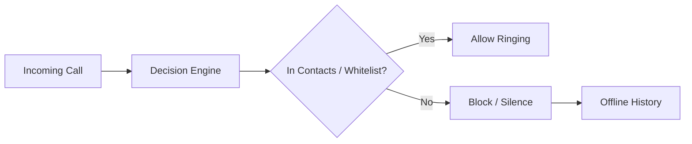

<div align="center">
  

  <h1>🛡️ Sentinela (Sentinel)</h1>
  
  <p><b>Local non-contact call blocker for Android — 100% Offline and Private.</b></p>
  
  <p>
    <i>Developed and maintained by <b>SierraTecnologia</b> and <b>RicaSoluções</b></i>
  </p>
  
  <p>
    <a href="README.md">🇧🇷 Português</a> |
    <a href="README.en.md">🇬🇧 English</a> |
    <a href="README.es.md">🇪🇸 Español</a>
  </p>

  <p>
    
    
    
    
  </p>
</div>

---

If a number isn't in your contacts or your personal whitelist, the call won't ring — no sound, no call screen, no interruption. **Open source, ad-free, telemetry-free, and cloud-free — running silently on your own device.**

## ✨ Core Features

Sentinela operates in **two protection modes**:

- 🛡️ **Filter Mode (Default)**
  The app acts as a background screening service (`ROLE_CALL_SCREENING`). Calls from numbers not in your contacts or personal list are filtered locally. Contacts ring normally. Numbers outside your contacts are instantly blocked or silenced.
  
- 📞 **Dialer Mode (Advanced)**
  Sentinela replaces your default phone app (`ROLE_DIALER`). This provides full protection over **all** calls, allowing you to configure policies (Block, Silence, Ring) even for specific contacts. It includes a clean, modern dialer interface.

> **Your privacy is our rule number zero:** Contact lookups occur entirely in memory. Names, numbers, or photos are never saved to disk and never leave your device.

## 🚀 How Screening Works



In-depth technical details can be found in [`docs/ARQUITETURA.md`](docs/ARQUITETURA.md) and known limitations are in [`docs/LIMITACOES.md`](docs/LIMITACOES.md) (in Portuguese).

## 🏢 Official Sponsors

This open-source project is developed and supported by:

- **SierraTecnologia** — Robust solutions in software engineering and digital privacy.
- **RicaSoluções** — Technological innovation focused on user experience.

Our commitment is to deliver a tracker-free tool focused entirely on your peace of mind.

## 🛠️ Build & Installation

### Prerequisites
- **JDK 17** (Recommended via Homebrew: `brew install openjdk@17`)
- **Android SDK** API 37
- Gradle via wrapper (no global installation required)

### Running Locally

To build, generate the APK, and install directly on your device via ADB:

```bash
# Build and copy APK (debug)
./build.sh

# Install on device
adb install sentinela-debug.apk
```

Ensure quality by running the test suite:

```bash
./gradlew testDebugUnitTest       # Unit tests (pure JVM engine)
./gradlew lint detekt             # Static analysis
```

For release builds (requires keystore configuration in `app/keystore.properties`):
```bash
./gradlew assembleRelease
```

## 🔒 Permissions (And why we need them)

| Permission | Purpose | Required? |
|------------|---------|-----------|
| `ROLE_CALL_SCREENING` | Enables the background filter. | **Yes** |
| `READ_CONTACTS` | Allows known calls to ring. Zero data saved. | Optional |
| `POST_NOTIFICATIONS` | Silent notification about blocked calls. | Optional |
| `ROLE_DIALER` | Needed only for the Advanced Dialer Mode. | Optional |

**What we DO NOT ask for:**
- ❌ No `INTERNET` permission
- ❌ No SMS reading (`READ_SMS`)
- ❌ No Call Log access (`READ_CALL_LOG`)

## 🤝 How to Contribute

All help is welcome, whether reporting bugs, improving translations, or writing code! 

Please read our [Contributing Guide](CONTRIBUTING.en.md) to understand our commit conventions, architectural rules, and code of conduct.

## 📚 Additional Documentation

*Most technical documentation is currently maintained in Portuguese.*
1. [`docs/INDEX.md`](docs/INDEX.md) — Complete index
2. [`docs/PROMPT-MVP.md`](docs/PROMPT-MVP.md) — Detailed original scope
3. [`docs/PRIVACIDADE.md`](docs/PRIVACIDADE.md) — Embedded privacy manifesto

## 💙 Support the Project

Sentinela is maintained voluntarily. If the app helped you regain your peace, consider supporting:

- ⭐ Star the repository!
- ☕ Donate (Bitcoin address available in the production app).

---
*Sentinela — Your offline guardian. Crafted with dedication by **SierraTecnologia** and **RicaSoluções**.*
