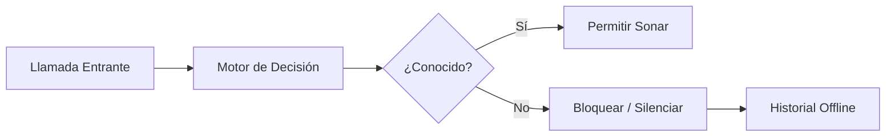

<div align="center">
  

  <h1>🛡️ Sentinela (Centinela)</h1>
  
  <p><b>Bloqueador local de llamadas desconocidas para Android — 100% Offline y Privado.</b></p>
  
  <p>
    <i>Desarrollado y mantenido por <b>SierraTecnologia</b> y <b>RicaSoluções</b></i>
  </p>
  
  <p>
    <a href="README.md">🇧🇷 Português</a> |
    <a href="README.en.md">🇬🇧 English</a> |
    <a href="README.es.md">🇪🇸 Español</a>
  </p>

  <p>
    
    
    
    
  </p>
</div>

---

Si el número no está en tus contactos ni en tu lista blanca personal, la llamada no suena — sin sonido, sin pantalla de llamada, sin interrupciones. **De código abierto, sin publicidad, sin telemetría y sin enviar datos a la nube — ejecutándose silenciosamente en tu propio dispositivo.**

## ✨ Características Principales

Sentinela opera en **dos modos de protección**:

- 🛡️ **Modo Filtro (Por defecto)**
  La aplicación actúa en segundo plano como servicio de detección (`ROLE_CALL_SCREENING`). Android solo reenvía llamadas de números **desconocidos** para su análisis. Los contactos de tu agenda suenan normalmente. Los números desconocidos son bloqueados o silenciados instantáneamente.
  
- 📞 **Modo Marcador (Avanzado)**
  Sentinela reemplaza tu aplicación de teléfono predeterminada (`ROLE_DIALER`). Esto proporciona protección total sobre **todas** las llamadas, permitiéndote configurar políticas (Bloquear, Silenciar, Sonar) incluso para contactos específicos. Incluye una interfaz de marcación limpia y moderna.

> **Tu privacidad es nuestra regla principal:** La lectura de contactos ocurre completamente en memoria. Los nombres, números o fotos nunca se guardan en el disco y nunca salen del dispositivo.

## 🚀 Cómo Funciona el Filtro



Detalles técnicos profundos se pueden encontrar en [`docs/ARQUITETURA.md`](docs/ARQUITETURA.md) y las limitaciones conocidas están en [`docs/LIMITACOES.md`](docs/LIMITACOES.md) (en portugués).

## 🏢 Patrocinadores Oficiales

Este proyecto de código abierto es desarrollado y apoyado por:

- **SierraTecnologia** — Soluciones robustas en ingeniería de software y privacidad digital.
- **RicaSoluções** — Innovación tecnológica enfocada en la experiencia del usuario.

Nuestro compromiso es ofrecer una herramienta libre de rastreadores, enfocada únicamente en tu tranquilidad.

## 🛠️ Build e Instalación

### Requisitos previos
- **JDK 17** (Recomendado vía Homebrew: `brew install openjdk@17`)
- **Android SDK** API 37
- Gradle vía wrapper (no requiere instalación global)

### Ejecución Local

Para compilar, generar el APK e instalar directamente en tu dispositivo vía ADB:

```bash
# Build y copia de APK (debug)
./build.sh

# Instalar en el dispositivo
adb install sentinela-debug.apk
```

Para asegurar la calidad, ejecuta la suite de pruebas:

```bash
./gradlew testDebugUnitTest       # Pruebas unitarias
./gradlew lint detekt             # Análisis estático
```

Para la compilación de lanzamiento (requiere configuración de keystore en `app/keystore.properties`):
```bash
./gradlew assembleRelease
```

## 🔒 Permisos (Y por qué los necesitamos)

| Permiso | Propósito | ¿Obligatorio? |
|---------|-----------|---------------|
| `ROLE_CALL_SCREENING` | Habilita el filtro en segundo plano. | **Sí** |
| `READ_CONTACTS` | Permite que las llamadas de conocidos suenen. Cero datos guardados. | Opcional |
| `POST_NOTIFICATIONS` | Notificación silenciosa sobre llamadas bloqueadas. | Opcional |
| `ROLE_DIALER` | Necesario solo para el Modo Marcador Avanzado. | Opcional |

**Lo que NO pedimos:**
- ❌ Sin permiso de `INTERNET`
- ❌ Sin lectura de SMS (`READ_SMS`)
- ❌ Sin acceso al registro de llamadas (`READ_CALL_LOG`)

## 🤝 Cómo Contribuir

¡Toda ayuda es bienvenida, ya sea reportando errores, mejorando traducciones o escribiendo código!

Por favor, lee nuestra [Guía de Contribución](CONTRIBUTING.es.md) para entender nuestras convenciones de commits, reglas de arquitectura y código de conducta.

## 📚 Documentación Adicional

*La mayor parte de la documentación técnica se mantiene actualmente en portugués.*
1. [`docs/INDEX.md`](docs/INDEX.md) — Índice completo
2. [`docs/PROMPT-MVP.md`](docs/PROMPT-MVP.md) — Alcance original detallado
3. [`docs/PRIVACIDADE.md`](docs/PRIVACIDADE.md) — Manifiesto de privacidad integrado

## 💙 Apoya el Proyecto

Sentinela se mantiene de forma voluntaria. Si la aplicación te ayudó a recuperar tu paz, considera apoyar:

- ⭐ ¡Dale una estrella al repositorio!
- ☕ Dona (Dirección de Bitcoin disponible en la aplicación de producción).

---
*Sentinela — Tu guardián offline. Creado con dedicación por **SierraTecnologia** y **RicaSoluções**.*
