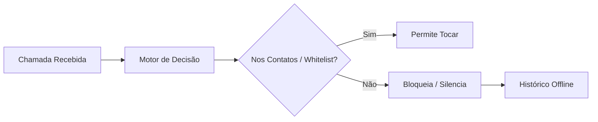

<div align="center">
  

  <h1>🛡️ Sentinela</h1>
  
  <p><b>Bloqueador local de chamadas de números fora dos contatos para Android — 100% Offline e Privado.</b></p>
  
  <p>
    <i>Desenvolvido e mantido por <b>SierraTecnologia</b> e <b>RicaSoluções</b></i>
  </p>
  
  <p>
    <a href="README.md">🇧🇷 Português</a> |
    <a href="README.en.md">🇬🇧 English</a> |
    <a href="README.es.md">🇪🇸 Español</a>
  </p>

  <p>
    
    
    
    
  </p>
</div>

---

Se o número não está nos seus contatos nem na sua whitelist pessoal, a chamada não toca — sem som, sem tela de chamada, sem notificação. **Open source, sem propaganda, sem telemetria, sem envio de dados para a nuvem — rodando silenciosamente no seu próprio aparelho.**

## ✨ Principais Funcionalidades

O Sentinela opera em **dois modos de proteção**:

- 🛡️ **Modo Filtro (Padrão)**
  O app atua em segundo plano com o papel de triagem (`ROLE_CALL_SCREENING`). Chamadas de números fora da agenda e fora da lista de permitidos são filtradas localmente. Contatos da sua agenda tocam normalmente. Números fora dos contatos são bloqueados ou silenciados instantaneamente.
  
- 📞 **Modo Discador (Avançado)**
  O Sentinela substitui o app de telefone padrão (`ROLE_DIALER`). Isso garante proteção total sobre **todas** as chamadas, permitindo que você configure políticas (Bloquear, Silenciar, Tocar) inclusive para contatos específicos. Acompanha uma interface de discagem limpa e moderna.

> **Sua privacidade é nossa regra número zero:** A leitura de contatos ocorre inteiramente na memória. Nomes, números ou fotos nunca são gravados em disco e nunca saem do aparelho.

## 🚀 Como Funciona a Triagem



Detalhes técnicos aprofundados podem ser encontrados em [`docs/ARQUITETURA.md`](docs/ARQUITETURA.md) e limitações conhecidas estão em [`docs/LIMITACOES.md`](docs/LIMITACOES.md).

## 🏢 Apoiadores Oficiais

Este projeto é uma iniciativa open-source desenvolvida e suportada por:

- **SierraTecnologia** — Soluções robustas em engenharia de software e privacidade digital.
- **RicaSoluções** — Inovação tecnológica e usabilidade focada no usuário.

Nosso compromisso é entregar uma ferramenta livre de rastreadores, focada unicamente na paz de espírito do usuário.

## 🛠️ Build & Instalação

### Pré-requisitos
- **JDK 17** (Recomendado via Homebrew: `brew install openjdk@17`)
- **Android SDK** API 37
- Gradle via wrapper (não requer instalação global)

### Rodando Localmente

Para compilar, gerar o APK e instalar diretamente no seu aparelho via ADB:

```bash
# Build e cópia do APK (debug)
./build.sh

# Instalar no dispositivo
adb install sentinela-debug.apk
```

Para garantir a qualidade, execute a suíte de testes:

```bash
./gradlew testDebugUnitTest       # Testes unitários do motor (puro JVM)
./gradlew lint detekt             # Análise estática (Sem erros!)
```

Para build de release (requer configuração do keystore em `app/keystore.properties`):
```bash
./gradlew assembleRelease
```
Veja mais em [`docs/RELEASE.md`](docs/RELEASE.md).

## 🔒 Permissões (E por que precisamos delas)

| Permissão | Propósito | Obrigatoriedade |
|-----------|-----------|-----------------|
| `ROLE_CALL_SCREENING` | Habilita o filtro em segundo plano. | **Obrigatória** |
| `READ_CONTACTS` | Permitir que chamadas de conhecidos toquem. Zero dados salvos. | Opcional |
| `POST_NOTIFICATIONS` | Aviso silencioso sobre ligações barradas. | Opcional |
| `ROLE_DIALER` | Necessário apenas para o Modo Discador Avançado. | Opcional |

**O que NÃO pedimos:**
- ❌ Sem permissão de `INTERNET`
- ❌ Sem permissão de Ler SMS (`READ_SMS`)
- ❌ Sem permissão para ocultar chamadas do histórico (`READ_CALL_LOG`)

Leia a matriz completa em [`docs/PERMISSOES.md`](docs/PERMISSOES.md).

## 🤝 Como Contribuir

Toda ajuda é bem-vinda, seja reportando bugs, melhorando traduções ou escrevendo código! 

Consulte nosso [Guia de Contribuição](CONTRIBUTING.md) para entender nossas convenções de commits, regras de arquitetura e código de conduta.

## 📚 Documentação Adicional

1. [`docs/INDEX.md`](docs/INDEX.md) — Índice completo
2. [`docs/PROMPT-MVP.md`](docs/PROMPT-MVP.md) — O escopo original detalhado
3. [`docs/PRIVACIDADE.md`](docs/PRIVACIDADE.md) — O manifesto de privacidade embutido
4. [`CLAUDE.md`](CLAUDE.md) / [`AGENTS.md`](AGENTS.md) — Diretrizes para agentes de IA atuando no repositório

## 💙 Apoie o Projeto

O Sentinela é mantido voluntariamente. Se o app te ajudou a recuperar a sua paz, considere apoiar:

- ⭐ Dê uma estrela no repositório!
- ☕ Faça uma doação em **Bitcoin** (on-chain) ou **Liquid (L-BTC)** — os endereços ficam na tela
  "Privacidade e sobre" do app, com botão de copiar. Eles moram só lá de propósito: endereço
  copiado para vários lugares é endereço que um dia diverge, e doação para endereço errado não
  tem volta.

---
*Sentinela — O seu guardião offline. Criado com dedicação pela **SierraTecnologia** e **RicaSoluções**.*
